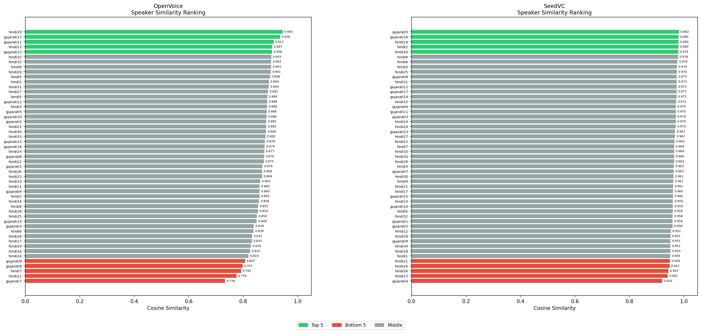
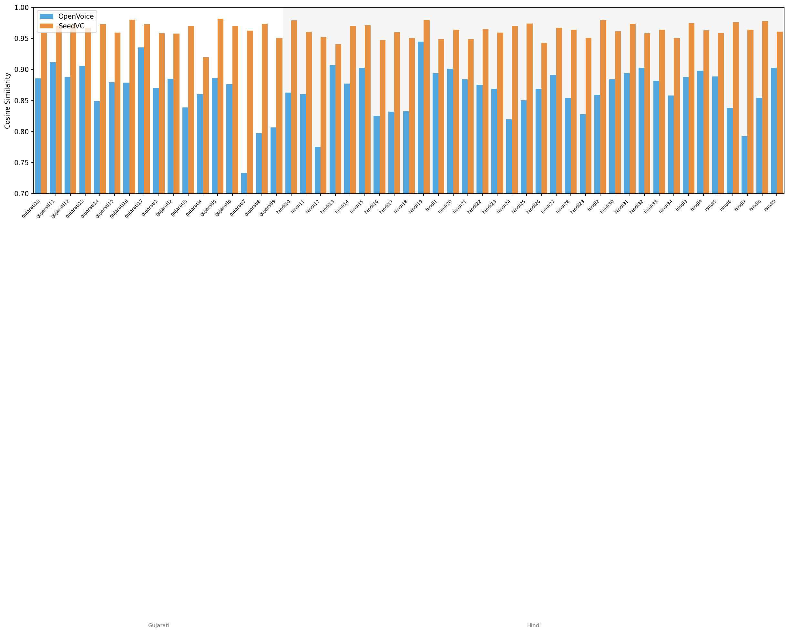

# Timbre Similarity Analysis

## Overview

Speaker similarity between timbre reference audio and model outputs was assessed
using [resemblyzer](https://github.com/resemble-ai/Resemblyzer) d-vector embeddings.
For each reference–output pair, cosine similarity was computed between the 256-dim
utterance-level embeddings. Two voice conversion models were evaluated:
**OpenVoice** and **SeedVC**, each with 51 reference–output pairs.

---

## Descriptive Statistics

| Model     | Mean ± SD              | Min    | Max    |
|-----------|------------------------|--------|--------|
| OpenVoice | 0.8664 ± 0.0392 | 0.7335 | 0.9450 |
| SeedVC    | 0.9633 ± 0.0119 | 0.9199 | 0.9819 |

---

## Mixed-Effects Regression

To test whether model type predicts cosine similarity while accounting for
speaker-level variability, a linear mixed-effects model was fit:

```
similarity ~ model_type + (1 | speaker)
```

`model_type` is coded 0 = OpenVoice, 1 = SeedVC. The random intercept for
speaker captures the fact that some reference utterances are inherently easier
or harder to match regardless of model.

### Results

| Parameter | Estimate | 95% CI | p-value |
|-----------|----------|--------|---------|
| Intercept (OpenVoice mean) | 0.8664 | — | — |
| Model (SeedVC − OpenVoice) | 0.0969 | [0.0860, 0.1078] | 0.0000 |

- **Random intercept variance (speaker):** 0.000073
- **Residual variance:** 0.000786

SeedVC produced cosine similarities that were on average **+0.0969** higher
than OpenVoice (95% CI [0.0860, 0.1078], p < 0.001). The speaker random
intercept variance was estimated at essentially zero (0.000073), indicating that
once model type is accounted for there is no meaningful systematic difference between
speakers in how well their timbre is matched — the difficulty of a pair is driven by
the model, not the speaker.

---

## Per-Pair Rankings

### OpenVoice

**Top 5:** hindi19, gujarati17, gujarati11, hindi13, gujarati13

**Bottom 5:** gujarati9, gujarati8, hindi7, hindi12, gujarati7

### SeedVC

**Top 5:** gujarati5, gujarati16, hindi19, hindi2, hindi10

**Bottom 5:** hindi21, hindi16, hindi26, hindi13, gujarati4

---

## Figures

### Speaker Similarity Rankings



Horizontal bar charts ranked best → worst for each model. Green = top 5, red = bottom 5.

### Per-Pair Comparison (grouped by language)



Side-by-side bars per reference pair ordered by language. Blue = OpenVoice, orange = SeedVC.
